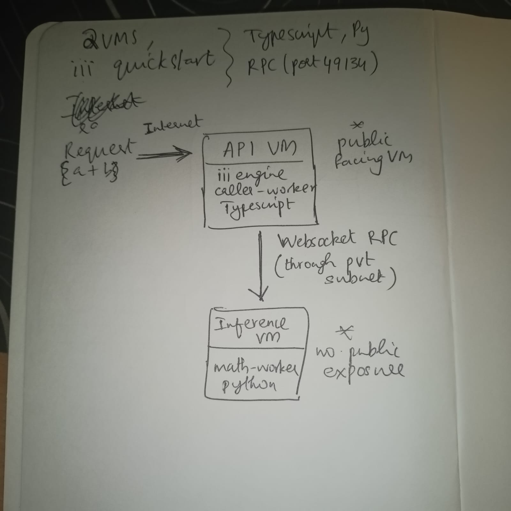

# Distributed Inferencing Deployment —> AlchemystAI DevOPS Assignment

## Overview

This project takes the `iii` quickstart — two workers in two different languages — and splits them
across multiple AWS EC2 instances instead of running everything on one machine. The goal: HTTP
handling and computation live on separate VMs, talking to each other over WebSocket RPC through
the iii engine. Neither worker knows (or cares) where the other one is running.

---

## Architecture (rough)



A request comes in over HTTP, the caller-worker fans it into an RPC call through the iii engine,
the math-worker does the work and returns a result, and the response travels back the same way.
The two workers are in different languages on different machines and neither has a hardcoded
reference to the other : the engine handles discovery and routing.

---

## Infrastructure

Provisioned with Terraform (see `/terraform`):

- VPC with public subnet
- Internet gateway + route table
- Security groups (API VM exposes port 3111; inference VM has no public ports)
- Two EC2 instances (API VM + Inference VM)

---

## Workers

| Worker | Language | What it does |
|---|---|---|
| `caller-worker` | TypeScript | Accepts HTTP requests, dispatches RPC calls into the mesh |
| `math-worker` | Python | Receives RPC calls, runs the computation, returns the result |

visualise it like this -> they talk through the iii engine over websocket. Swap either one out, scale either one independently ... the other doesn't notice.

---

## Deployment

### 1. Provision infrastructure

```bash
cd terraform
terraform init
terraform apply
```

### 2. Start the iii engine (API VM)

```bash
docker-compose up -d --build
```

### 3. Start the caller-worker (API VM)

```bash
cd quickstart/workers/caller-worker
npm install
npm run dev
```

### 4. Start the math-worker (Inference VM)

```bash
cd quickstart/workers/math-worker
python3 -m venv venv
source venv/bin/activate
pip install -r requirements.txt
III_URL=ws://<API_PRIVATE_IP>:49134 python math_worker.py
```

---

## API

### Endpoint

```
POST /math/add-two-numbers
```

### Request

```bash
curl -X POST http://<API_PUBLIC_IP>:3111/math/add-two-numbers \
  -H "Content-Type: application/json" \
  -d '{"a": 5, "b": 7}'
```

### Response

```json
{
  "c": 12
}
```

---

## What I'd harden if this were to be deployed in production 

The inference VM was given temporary public access during development to make debugging easier.
In production that goes away, along with a few other shortcuts:

- Inference workers fully inside a private subnet, outbound-only via NAT Gateway
- IAM instance roles instead of any manually managed credentials
- Workers containerized individually and orchestrated via ECS or Kubernetes
- Secrets in AWS Secrets Manager, not environment variables
---

## Scaling to a 100x Larger Model

- HEavier GPU instances (g4dn/g5) for inference
- Multiple inference workers load balanced by the iii engine
- Redis or rabbitmq for queing workers
- Spot instances to manage GPU costs